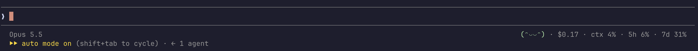
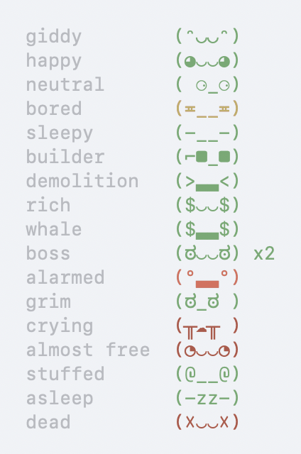

# tokamon

**A tiny pet that lives in your Claude Code status line and feeds on your tokens.**



Your tokamon sits next to your usage stats and reacts to your session. It starts out bouncy, gets `$` eyes as the bill climbs, side-eyes you as your usage limit runs low, and keels over when you hit it. It fidgets while Claude works, bosses subagents around, and falls asleep when you walk away.

| Dark | Light |
|---|---|
|  |  |

## Install

You need [Claude Code](https://claude.com/claude-code) and `jq`.

**1. Get the script**

```sh
curl -o ~/.claude/statusline.sh https://raw.githubusercontent.com/fidelisakilan/tokamon/main/statusline.sh
chmod +x ~/.claude/statusline.sh
```

**2. Add it to `~/.claude/settings.json`** (merge with any hooks you already have)

```json
{
  "statusLine": { "type": "command", "command": "~/.claude/statusline.sh", "refreshInterval": 1 },
  "hooks": {
    "UserPromptSubmit": [{ "hooks": [{ "type": "command", "command": "~/.claude/statusline.sh busy" }] }],
    "Stop":             [{ "hooks": [{ "type": "command", "command": "~/.claude/statusline.sh idle" }] }],
    "SubagentStart":    [{ "hooks": [{ "type": "command", "command": "~/.claude/statusline.sh agent-start" }] }],
    "SubagentStop":     [{ "hooks": [{ "type": "command", "command": "~/.claude/statusline.sh agent-stop" }] }]
  }
}
```

Your tokamon hatches on the next redraw.

## Moods

When several apply, the first match wins.

| Face | Mood | When |
|------|------|------|
| `(☓‿‿☓)` | dead | 5h or 7d limit hit 100% |
| `(-zz-)` | asleep | nothing happened for 10 minutes |
| `(@▃▃@)` | stuffed | context window 90%+ full |
| `(◔‿‿◔)` | almost free | 5h at 60%+, but it resets within 20 minutes |
| `(╥☁╥ )` | crying | 5h at 90%+ |
| `(ಠ_ಠ )` | grim | 7d at 90%+ |
| `(°▃▃°)` | alarmed | 5h at 75%+ |
| `(ಠ‿‿ಠ) x2` | boss | subagents running, with a head count |
| `($▃▃$)` | whale | session cost $50+ |
| `($‿‿$)` | rich | session cost $10+ |
| `(>▃▃<)` | demolition | 300+ lines removed, more than added |
| `(⌐■_■)` | builder | 500+ lines added |
| `(-__-)` | sleepy | session over 4 hours, or it's midnight to 6am |
| `(≖__≖)` | bored | 5h at 60%+ |
| `(•‿‿•)` | neutral | 5h at 45%+ |
| `(◕‿‿◕)` | happy | 5h at 15%+ |
| `(ᵔ◡◡ᵔ)` | giddy | 5h under 15% |

The face's colour warns you as the 5-hour limit fills: green, yellow at 60%, orange at 75%, red at 90%. On API-key plans with no usage limits, context use stands in for 5h usage.

## What else is on the line

| | |
|---|---|
| `Opus 5.5` | the model you're on |
| `$0.17` | this session's cost, estimated at API prices (not what a Pro/Max plan bills) |
| `ctx 4%` | how full the context window is |
| `5h 6%` | 5-hour usage limit used |
| `7d 31%` | weekly usage limit used |

## How it works

- **Moods** come from the data Claude Code already passes to status line scripts: cost, context, usage limits, lines changed, session length.
- **Animation:** the hooks mark when Claude starts and stops working. While it works, the pet glances around, blinks, and now and then puts on shades. When idle, it holds still.
- **Subagents** are counted by the `SubagentStart`/`SubagentStop` hooks.
- **Without the hooks** the pet still shows its mood, it just never animates or counts agents.
- `refreshInterval: 1` redraws every second, the fastest Claude Code allows. Each redraw takes about 18ms.

## Tweaking

All thresholds (the $10 and $50 money marks, the 10-minute nap, and so on) and every face live in one block in `statusline.sh`, marked `# first match wins`. Edit and save; the next redraw picks it up.

Run `./test.sh` to check every mood still resolves. `screenshots/gallery.sh static|moving` draws all the moods at once, which is handy for trying out new faces.

## Uninstall

Delete `~/.claude/statusline.sh`, then remove the `statusLine` entry and the four hooks from `~/.claude/settings.json`.

## Credits

Faces inspired by [pwnagotchi](https://pwnagotchi.ai).
