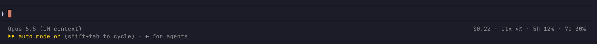
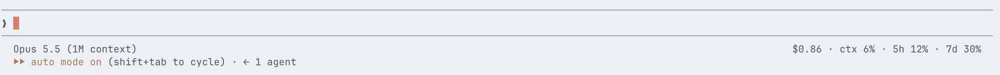

# claude-usage-statusline

A one-line [Claude Code](https://claude.com/claude-code) status line: the model on the left; session cost, context use, plan usage limits, and a mood face on the right.

**Dark**



**Light**



| Field | Meaning |
|-------|---------|
| `(^‿^)` | Mood face that tracks 5h usage (context use if there are no plan limits) and blinks now and then:<br>`(^‿^)` 0% · `(^_^)` 15% · `(•‿•)` 30% · `(•_•)` 45% · `(¬_¬)` 60% · `(°□°)` 75% · `(ಥ_ಥ)` 90% · `(×_×)` 100% |
| `$0.22` | Estimated cost of the current session (API pricing; not what a Pro/Max plan bills) |
| `ctx` | Context window used |
| `5h` | 5-hour plan usage limit used |
| `7d` | Weekly plan usage limit used |

`5h`/`7d` only appear when Claude Code provides rate-limit data (subscription plans).

## Install

Requires `jq`.

```sh
curl -o ~/.claude/statusline.sh https://raw.githubusercontent.com/fidelisakilan/claude-usage-statusline/main/statusline.sh
chmod +x ~/.claude/statusline.sh
```

Add to `~/.claude/settings.json`:

```json
{
  "statusLine": { "type": "command", "command": "~/.claude/statusline.sh", "refreshInterval": 2 }
}
```

## Notes

Right alignment reads the terminal width from `/dev/tty`, then `$COLUMNS`. If neither is available, the usage stats sit two spaces after the model name.

`refreshInterval: 2` re-runs the script every 2 seconds so the alignment catches up after you resize or zoom the terminal; without it, Claude Code only redraws the status line on conversation events.
