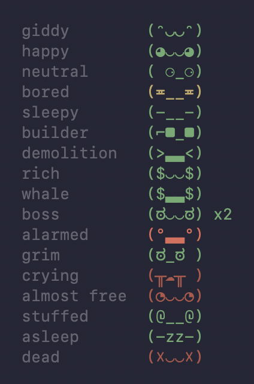

# tokamon

**A tiny pet that lives in your Claude Code status line and feeds on your tokens.**

Your tokamon sits next to your usage stats and reacts to your session. It starts out bouncy, gets `$` eyes as the bill climbs, side-eyes you as your usage limit runs low, and keels over when you hit it. It fidgets while Claude works, bosses subagents around, and falls asleep when you walk away.

## Install

You need [Claude Code](https://claude.com/claude-code), `jq` and `bash` (macOS, Linux, or WSL on Windows).

```sh
curl -fsSL https://raw.githubusercontent.com/fidelisakilan/tokamon/main/install.sh | bash
```

This copies `statusline.sh` to `~/.claude/` and adds the status line and four hooks to `~/.claude/settings.json`, keeping everything else in it. Your old settings are saved to `settings.json.bak`, and running it again is safe.

<details>
<summary>Manual install</summary>

```sh
curl -o ~/.claude/statusline.sh https://raw.githubusercontent.com/fidelisakilan/tokamon/main/statusline.sh
chmod +x ~/.claude/statusline.sh
```

Then add to `~/.claude/settings.json`, merging with any hooks you already have:

```json
{
  "statusLine": { "type": "command", "command": "~/.claude/statusline.sh", "refreshInterval": 1 },
  "hooks": {
    "UserPromptSubmit": [{ "hooks": [{ "type": "command", "command": "~/.claude/statusline.sh busy" }] }],
    "Stop":             [{ "hooks": [{ "type": "command", "command": "~/.claude/statusline.sh idle" }] }],
    "SubagentStart":    [{ "hooks": [{ "type": "command", "command": "~/.claude/statusline.sh agent-start" }] }],
    "SubagentStop":     [{ "hooks": [{ "type": "command", "command": "~/.claude/statusline.sh agent-stop" }] }]
  }
}
```

</details>

Your tokamon hatches on the next redraw.

## Moods



When several apply, the first match wins.

| Face | Mood | When |
|------|------|------|
| `(x_x)` | dead | 5h or 7d limit hit 100% |
| `(-_-)zz` | asleep | nothing happened for 10 minutes |
| `(◉Д◉)` | stuffed | context window 90%+ full |
| `(◔_◔)` | clock-watching | 5h at 60%+, but it resets within 20 minutes |
| `(╥_╥)` | crying | 5h at 90%+ |
| `(ಠ_ಠ)` | grim | 7d at 90%+ |
| `(°▃°)` | worried | 5h at 75%+ |
| `(¬‿¬) x2` | boss | subagents running, with a head count |
| `($Д$)` | bonfire | session cost $100+ |
| `($▃$)` | whale | session cost $50+ |
| `($‿$)` | rich | session cost $10+ |
| `(>Д<)` | wrecking ball | 1000+ lines removed, more than added |
| `(>▃<)` | demolition | 300+ lines removed, more than added |
| `(⌐■‿■)` | architect | 2000+ lines added |
| `(⌐■_■)` | builder | 500+ lines added |
| `(-o-)` | yawning | session over 4 hours, or it's midnight to 6am |
| `(≖_≖)` | meh | 5h at 60%+ |
| `(◕‿◕)` | happy | 5h at 15%+ |
| `(^‿^)` | fresh | 5h under 15% |

The eyes say what it's about (`$` money, `⌐■` building, `><` demolishing) and the mouth says how hard: `‿` → `▃` → `Д`. The mood's name sits dimmed next to the face.

The face's colour warns you as the 5-hour limit fills: green, yellow at 60%, orange at 75%, red at 90%. On API-key plans with no usage limits, context use stands in for 5h usage.

## What else is on the line

| | |
|---|---|
| `Opus 5.5` | the model you're on |
| `$0.17` | this session's cost, estimated at API prices (not what a Pro/Max plan bills) |
| `ctx 4%` | how full the context window is |
| `5h 6%` | 5-hour usage limit used |
| `7d 31%` | weekly usage limit used |

## How it works

- **Moods** come from the data Claude Code already passes to status line scripts: cost, context, usage limits, lines changed, session length.
- **Animation:** the hooks mark when Claude starts and stops working. While it works, the pet blinks and moves its mouth, and now and then puts on shades. When idle, it holds still.
- **Subagents** are counted by the `SubagentStart`/`SubagentStop` hooks.
- **Without the hooks** the pet still shows its mood, it just never animates or counts agents.
- `refreshInterval: 1` redraws every second, the fastest Claude Code allows. Each redraw takes about 18ms.

## Tweaking

All thresholds (the $10/$50/$100 money marks, the 10-minute nap, and so on) and every face live in one block in `statusline.sh`, marked `# first match wins`. Edit and save; the next redraw picks it up.

Run `./test.sh` to check every mood still resolves (tested on macOS, Debian, Ubuntu and Alpine). `screenshots/gallery.sh static|moving` draws all the moods at once, which is handy for trying out new faces.

## Uninstall

```sh
curl -fsSL https://raw.githubusercontent.com/fidelisakilan/tokamon/main/install.sh | bash -s uninstall
```

This removes the script, the status line and the four hooks, and leaves the rest of your settings alone.

## Credits

Faces inspired by [pwnagotchi](https://pwnagotchi.ai).
